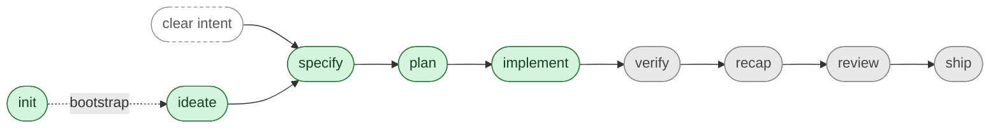

# SpecStudio Skills

The Claude Code skills that make up SpecStudio. Each skill owns one phase of the spec-driven development lifecycle and gates the next on a lint-clean SpecScore artifact.

For the product overview and install instructions, see the [repo README](../README.md). For the design philosophy these skills share, see [`shared/philosophy.md`](./shared/philosophy.md).

## Lifecycle

Each in-line phase consumes the previous phase's lint-clean artifact and gates the next. Green = Shipped, yellow = Defined, gray = Roadmap. `specify` also accepts a clear buildable intent directly — `ideate` is skippable when the problem and scope are already obvious. `init` sits outside the loop: it's the one-time-per-project bootstrap that creates `specscore.yaml` + the `spec/` tree + the canonical instruction snippet, then hands off to `ideate` / `specify` for normal use.

## Status

| Skill | Status | Purpose |
|---|---|---|
| [`init`](./init/SKILL.md) | Shipped | Bootstrap a SpecScore-managed project: `specscore.yaml`, `spec/` tree, instruction snippet, orchestration setup. One-time-per-project. |
| [`ideate`](./ideate/SKILL.md) | Shipped | Refine raw ideas into lint-clean SpecScore Idea artifacts. |
| [`specify`](./specify/SKILL.md) | Shipped | Turn an approved Idea into a lint-clean SpecScore Feature with G/W/T acceptance criteria. |
| [`plan`](./plan/SKILL.md) | Shipped | Turn an approved Feature into an ordered, AC-mapped Plan artifact at `spec/plans/<slug>.md`. |
| [`implement`](./implement/SKILL.md) | Shipped | Dispatch one subagent per Plan task in parallel batches; stage AC-traceable code changes with a `Verifies:` commit-message trailer; per-batch user-approval gate. |
| `verify` | Roadmap | Run Rehearse tests against acceptance criteria; report coverage. |
| `recap` | Roadmap | Summarize what was built against what was specified; surface drift. |
| `review` | Roadmap | Multi-axis review of code against the Feature it claims to satisfy. |
| `ship` | Roadmap | Pre-launch checklist gated on verify + review passing. |

### Recovery & tooling

Skills outside the lifecycle spine — invoked on demand to recover from misroutes or operate on existing SpecScore artifacts.

| Skill | Status | Purpose |
|---|---|---|
| [`relocate-idea`](./relocate-idea/SKILL.md) | Shipped | Relocate an Idea or sidekick-seed from the current repo to another SpecScore-managed repo. Thin shell over the `specscore idea relocate` CLI verb; appends a best-effort mismatch-log line on success. |

### Status definitions

- **Shipped** — Skill folder exists at `skills/<name>/` with a working `SKILL.md`. Usable today via Claude Code.
- **Defined** — No skill yet. A lint-clean `spec/ideas/<slug>.md` (or Feature) exists with an Approved status; the problem and recommended direction are written down. Next step: promote via `specify`, then implement.
- **Roadmap** — No skill, no Idea, no Feature. The name is reserved on the lifecycle list; scope is TBD. Next step: `ideate` it.

The status cell links to the most-precise artifact that exists for each skill (`SKILL.md` for shipped, the Idea file for defined, no link for roadmap).

## Skills

### `init` — Shipped

Bootstraps a SpecScore-managed project in one wizard-driven step. Detects current state by direct repo inspection, then idempotently creates `specscore.yaml`, scaffolds the `spec/` tree, pastes the canonical Producer-shape instruction snippet into the right platform agent-instructions file, and runs orchestration setup.

- **Output:** `specscore.yaml` + lint-clean `spec/{,ideas,features}/README.md` + the canonical snippet pasted into one of `CLAUDE.md` / `AGENTS.md` / `GEMINI.md` / `.cursor/rules/specstudio.md` per the explicit platform-detection rule.
- **Triggers:** `specstudio:init`, `/specstudio:init`, "set up specstudio", "init synchestra project", "bootstrap a spec repo".
- **Two modes:** default (full wizard) and `--update` (drift-only reconciliation).
- **CLI delegation:** prefers `specscore init` and `synchestra init`; AI-agent fallback when CLIs absent. CLI installation is delegated to `specscore:install` and `synchestra:install` with explicit user consent.
- **Source:** [`init/SKILL.md`](./init/SKILL.md)

### `ideate` — Shipped

Refines raw, vague ideas into SpecScore Idea artifacts through structured divergent and convergent thinking.

- **Output:** lint-clean `spec/ideas/<slug>.md` with Problem Statement, Recommended Direction, Alternatives Considered, MVP Scope, Not Doing, Key Assumptions, Open Questions.
- **Triggers:** `ideate`, `/ideate`, "refine this idea", "stress-test this".
- **Gate:** Does not invoke `specify`, `writing-plans`, or any implementation skill until the Idea is lint-clean and user-approved.
- **Source:** [`ideate/SKILL.md`](./ideate/SKILL.md)

### `specify` — Shipped

Turns an approved Idea (or a clear buildable intent) into a SpecScore Feature with requirements and `Given / When / Then` acceptance criteria.

- **Output:** lint-clean `spec/features/<slug>/` containing the Feature, requirements, ACs, and optional Rehearse test stubs.
- **Triggers:** `specify`, `/specify`, "spec this out", or the `idea.approved` Synchestra event.
- **Gate:** No code, plans, or scaffolding until the Feature is lint-clean and user-approved.
- **Source:** [`specify/SKILL.md`](./specify/SKILL.md)

### `plan` — Shipped

Turns an approved Feature into a single-file Plan at `spec/plans/<slug>.md` — an ordered, AC-mapped task list. Closes the gap where users previously fell back to SpecScore-blind planning skills.

- **Output:** lint-clean `spec/plans/<slug>.md` with tasks numbered 1..N, each bound to ≥1 AC ID from the source Feature.
- **Triggers:** `plan`, `/plan`, `specstudio:plan`, "plan this feature", or the `feature.approved` Synchestra event.
- **Gate:** AC coverage (every AC covered or explicitly deferred, lint rule `P-001`), lint, baseline reviewer + any third-party reviewers (AND composition), user approval. No transition to `specstudio:implement` until all five hold.
- **Source:** [`plan/SKILL.md`](./plan/SKILL.md)

### `implement` — Shipped

Consumes an approved Plan; dispatches one subagent per task in parallel batches computed from the Plan's `**Depends-On:**` dependency graph; stages every batch's changes with a mandatory `Verifies: <feature-slug>#ac:<ac-slug>, ...` commit-message trailer that the user pastes when committing. Linear in user interaction (one approval per batch), parallel in execution (subagent fan-out within a batch).

- **Output:** staged source-code changes (one or more `git diff --staged` batches across the Plan's lifetime), plus per-task `**Status:**` writes on the Plan file; in `**Mode:** stub` Plans, also writes back task bodies with post-hoc 1–2 sentence summaries.
- **Triggers:** `implement`, `/implement`, `specstudio:implement`, "implement this plan", or the `plan.approved` Synchestra event.
- **Gate:** Plan Status ∈ {Approved, Implementing}, Source Feature Status ∈ {Approved, Implementing, Stable}, lint after every batch, line-overlap conflict detection post-batch, explicit per-batch user approval, user-commit-before-next-batch. Promotion boundary is `specstudio:verify` only.
- **Source:** [`implement/SKILL.md`](./implement/SKILL.md)

### `verify` — Roadmap

The skill that runs the Feature's Rehearse tests and reports per-AC pass/fail coverage.

Scope TBD. Next step: `ideate` it.

### `recap` — Roadmap

The skill that summarizes what was actually built against what was specified, surfacing spec↔code drift before review.

Scope TBD. Next step: `ideate` it.

### `review` — Roadmap

The skill that does multi-axis code review of an implementation against the Feature it claims to satisfy.

Scope TBD. Next step: `ideate` it.

### `ship` — Roadmap

The skill that runs the pre-launch checklist, gated on `verify` and `review` having passed.

Scope TBD. Next step: `ideate` it.

## Recovery & tooling

### `relocate-idea` — Shipped

A thin shell over the [`specscore idea relocate`](https://github.com/specscore/specscore-cli/blob/main/spec/features/cli/idea/relocate/README.md) CLI verb. Relocates an Idea (`spec/ideas/<slug>.md`) or sidekick seed (`spec/ideas/seeds/<slug>.md`) from the current repo to another SpecScore-managed repo. The CLI handles every mechanic — pre-flight clean-tree checks, file copy + in-file rewrite, cross-repo link cleanup, per-repo commits, rollback on failure. The skill's job is argument collection, shell-out, verbatim output surfacing, and a single best-effort mismatch-log line on success.

- **Output:** the CLI verb's per-repo lines plus summary (verbatim), and one JSON line appended to `.synchestra/destination-resolution-log.jsonl` in the source repo's cwd on exit 0.
- **Triggers:** `specstudio:relocate-idea`, `/relocate-idea`, "relocate this idea", "move this seed to another repo".
- **Gate:** `specscore` must be on PATH (delegate install to `/specscore:install` if missing). The skill surfaces the CLI's exit code verbatim — no paraphrasing of rollback commands on commit failure.
- **Companion Feature:** [`sidekick-capture/destination-resolution`](../spec/features/sidekick-capture/destination-resolution/README.md) — defines this skill alongside the sidekick pre-write destination-resolution hook.
- **Source:** [`relocate-idea/SKILL.md`](./relocate-idea/SKILL.md)

## `shared/`

Not a skill. [`shared/`](./shared/) holds cross-cutting reference material the SKILL.md files load on demand: the philosophy, path conventions, lint rules, the Synchestra event vocabulary, the Rehearse heuristic, and the question cadence. Treat these as the kit every skill imports from, not as something a user invokes.
