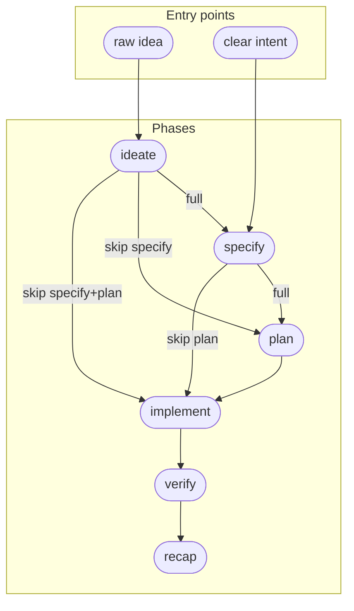

# Feature: Flexible Lifecycle Flows

> [SpecScore.**Studio**](https://specscore.studio): | [Explore](https://specscore.studio/app/github.com/specscore/specstudio-skills/spec/features/flexible-lifecycle-flows?op=explore) | [Edit](https://specscore.studio/app/github.com/specscore/specstudio-skills/spec/features/flexible-lifecycle-flows?op=edit) | [Ask question](https://specscore.studio/app/github.com/specscore/specstudio-skills/spec/features/flexible-lifecycle-flows?op=ask) | [Request change](https://specscore.studio/app/github.com/specscore/specstudio-skills/spec/features/flexible-lifecycle-flows?op=request-change) |
**Status:** Approved
**Date:** 2026-05-25
**Owner:** alexander.trakhimenok
**Source Ideas:** flexible-lifecycle-flows
**Supersedes:** —

## Summary

Let users choose lighter lifecycle flows at transition time — skipping specify, plan, or both — while recording every deviation via events for auditability. Each skill with multiple valid downstream paths presents them as a structured choice; heuristics suggest the lighter path for small scope but never auto-apply.

## Problem

Every skill hardcodes a single downstream transition (ideate→specify, specify→plan, plan→implement). The specify skill explicitly rejects "too simple to spec." But for trivial changes (typo fixes, 1-file edits) and one-time work (migrations), the full pipeline costs more in ceremony than it returns in quality. Users either endure the overhead or work outside the pipeline entirely — losing the traceability that makes SpecStudio valuable.

The valid flow graph after this Feature ships:



## Behavior

### Transition menus

At transition time, skills with multiple valid downstream paths present a structured choice to the user via `AskUserQuestion`. The user always decides — no silent routing.

#### REQ: ideate-transition-menu

After an Idea is approved, the `specstudio:ideate` skill MUST present three downstream options via `AskUserQuestion`:

1. **Specify** — full Feature with G/W/T acceptance criteria (default).
2. **Plan** — ordered task list directly from the Idea (skips specify).
3. **Implement** — code directly from the Idea (skips specify + plan).

The skill MUST NOT silently route to `specstudio:specify` without presenting the choice. The default option (Specify) MUST be listed first.

#### REQ: specify-transition-menu

After a Feature is approved, the `specstudio:specify` skill MUST present two downstream options via `AskUserQuestion`:

1. **Plan** — ordered task list with AC mapping (default).
2. **Implement** — code directly from the Feature (skips plan).

The skill MUST NOT silently route to `writing-plans` without presenting the choice. The default option (Plan) MUST be listed first.

### Entry gate relaxation

Skills that currently accept only one upstream artifact type are relaxed to accept alternatives when a phase was skipped.

#### REQ: plan-accepts-idea

The `specstudio:plan` skill MUST accept an approved Idea as its source artifact, in addition to approved Features. When sourced from an Idea:

- The Plan's `**Source:**` line references the Idea slug (e.g., `**Source:** idea:flexible-lifecycle-flows`).
- AC-coverage enforcement (lint rule `P-001`) is skipped — there are no formal ACs to cover.
- Tasks reference the Idea slug in their `**Source:**` line instead of `**Verifies:**` AC IDs.
- All other Plan gates (lint, reviewer, user approval) still apply.

#### REQ: implement-accepts-feature

The `specstudio:implement` skill MUST accept a direct handoff from `specstudio:specify` when the user chose "Implement" at the specify transition menu. In this mode:

- No Plan artifact exists or is required.
- Implement works against the Feature's ACs directly — each commit's `Verifies:` trailer references Feature AC IDs as usual.
- The per-batch dispatch model does not apply (no Plan tasks to batch). Implement operates as a single-pass: the user describes what to change, the skill stages it, the user commits.

#### REQ: implement-accepts-idea

The `specstudio:implement` skill MUST accept a direct handoff from `specstudio:ideate` when the user chose "Implement" at the ideate transition menu. In this mode:

- No Feature or Plan artifact exists or is required.
- The `Verifies:` commit-message trailer references the Idea slug (e.g., `Verifies: idea:flexible-lifecycle-flows`).
- Implement operates as a single-pass against the Idea's Recommended Direction.

### Deviation recording

Phase skips are recorded as events for auditability.

#### REQ: phase-skipped-event

Every phase skip MUST emit a `lifecycle.phase-skipped` event with the following payload:

```yaml
event: lifecycle.phase-skipped
version: 1
payload:
  from_phase: ideate | specify
  skipped_phases: [specify] | [plan] | [specify, plan]
  to_phase: plan | implement
  reason: user-requested | scope-suggested
  source_artifact:
    type: idea | feature
    path: <path relative to repo root>
    slug: <slug>
```

The event MUST be emitted by the skill that presents the transition menu (ideate or specify), not by the receiving skill. The event MUST be emitted before invoking the downstream skill.

### Scope heuristics

Skills suggest lighter flows for small-scope work, but never auto-apply.

#### REQ: skip-suggestion-heuristics

When presenting the transition menu, skills SHOULD detect small scope and highlight the lighter option with a "(suggested for small scope)" label:

- **From specify:** if the Feature has ≤2 acceptance criteria → suggest "Implement (skip plan)".
- **From ideate:** if the user explicitly describes the change as trivial (uses words like "trivial", "quick fix", "typo", "one-liner", "simple") → suggest "Implement (skip specify + plan)".

Suggestions MUST NOT auto-select. The user MUST explicitly choose. Suggestions are suppressible via `lifecycle.suggest_skips: false` in `specscore.yaml` (default: `true`).

## Acceptance Criteria

### AC: ideate-presents-three-options (verifies REQ:ideate-transition-menu)

**Given** a user has an approved Idea
**When** the ideate skill reaches its transition step
**Then** the skill presents exactly three downstream options (Specify, Plan, Implement) via `AskUserQuestion`, with Specify listed first as the default

### AC: ideate-routes-to-plan (verifies REQ:ideate-transition-menu)

**Given** a user chose "Plan" at the ideate transition menu
**When** the ideate skill processes the choice
**Then** the skill invokes `specstudio:plan` with the Idea slug as the source artifact

### AC: ideate-routes-to-implement (verifies REQ:ideate-transition-menu)

**Given** a user chose "Implement" at the ideate transition menu
**When** the ideate skill processes the choice
**Then** the skill invokes `specstudio:implement` with the Idea slug as the source artifact

### AC: specify-presents-two-options (verifies REQ:specify-transition-menu)

**Given** a user has an approved Feature
**When** the specify skill reaches its transition step
**Then** the skill presents exactly two downstream options (Plan, Implement) via `AskUserQuestion`, with Plan listed first as the default

### AC: specify-routes-to-implement (verifies REQ:specify-transition-menu)

**Given** a user chose "Implement" at the specify transition menu
**When** the specify skill processes the choice
**Then** the skill invokes `specstudio:implement` with the Feature slug as the source artifact

### AC: plan-accepts-idea-source (verifies REQ:plan-accepts-idea)

**Given** the plan skill is invoked with an Idea slug as the source
**When** the plan skill resolves the source artifact
**Then** it loads the Idea at `spec/ideas/<slug>.md`, confirms Status is Approved, and proceeds without requiring a Feature

### AC: plan-skips-ac-coverage (verifies REQ:plan-accepts-idea)

**Given** a Plan is sourced from an Idea (no Feature)
**When** `specscore spec lint` runs against the Plan
**Then** lint rule `P-001` (AC coverage) does not fire — there are no ACs to enforce coverage against

### AC: implement-works-without-plan (verifies REQ:implement-accepts-feature)

**Given** the implement skill is invoked with a Feature slug and no Plan exists
**When** the user describes a change
**Then** implement stages the change with a `Verifies:` trailer referencing the Feature's AC IDs, without requiring Plan tasks or batching

### AC: implement-works-with-idea-only (verifies REQ:implement-accepts-idea)

**Given** the implement skill is invoked with an Idea slug and no Feature or Plan exists
**When** the user describes a change
**Then** implement stages the change with a `Verifies: idea:<slug>` trailer, operating against the Idea's Recommended Direction

### AC: skip-event-emitted (verifies REQ:phase-skipped-event)

**Given** a user chose a non-default option at a transition menu (e.g., "Implement" from ideate)
**When** the skill processes the choice
**Then** a `lifecycle.phase-skipped` event is emitted with correct `from_phase`, `skipped_phases`, `to_phase`, `reason`, and `source_artifact` fields, before the downstream skill is invoked

### AC: skip-event-not-emitted-on-default (verifies REQ:phase-skipped-event)

**Given** a user chose the default option at a transition menu (e.g., "Specify" from ideate)
**When** the skill processes the choice
**Then** no `lifecycle.phase-skipped` event is emitted

### AC: suggest-skip-plan-on-small-feature (verifies REQ:skip-suggestion-heuristics)

**Given** a Feature with ≤2 acceptance criteria
**When** the specify transition menu is presented
**Then** the "Implement (skip plan)" option includes a "(suggested for small scope)" label

### AC: suggestion-suppressed-by-config (verifies REQ:skip-suggestion-heuristics)

**Given** `lifecycle.suggest_skips: false` is set in `specscore.yaml`
**When** any transition menu is presented
**Then** no option carries a suggestion label, regardless of scope heuristics

## Open Questions

- How does verify/recap adapt when upstream phases were skipped? (Deferred to a separate Feature — verify/recap adaptation.)
- Should the `Verifies: idea:<slug>` trailer format be registered as a formal extension to the commit-trailer contract, or kept informal?

---
*This document follows the https://specscore.md/feature-specification*
