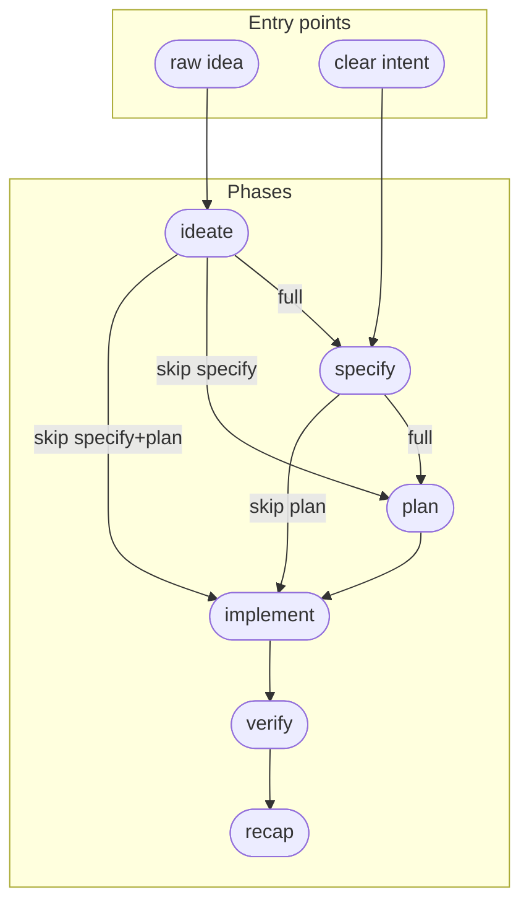

# Idea: Flexible Lifecycle Flows

**Status:** Specified
**Date:** 2026-05-25
**Owner:** alexander.trakhimenok
**Promotes To:** flexible-lifecycle-flows
**Supersedes:** —
**Related Ideas:** extends:specstudio-implement-skill, extends:specstudio-plan-skill

## Problem Statement

How might we let users choose lighter lifecycle flows — skipping specify, plan, or both — without losing the auditability that makes the full pipeline valuable?

## Context

Currently every skill hardcodes exactly one downstream transition (ideate→specify, specify→plan, plan→implement). The specify skill has an explicit anti-pattern section saying 'every Feature goes through this.' But for trivial changes (typo fixes, 1-file changes) or one-time work (migrations), the full pipeline is excessive. The archived trivial-mode-plans idea took a different approach (simplify plan content while keeping all phases); this idea is broader — allowing users to skip entire phases.

## Recommended Direction

**Skip-at-transition with scope-adaptive suggestions.** Each skill that has multiple valid downstream paths presents them at transition time. Heuristics suggest the lighter path for small scope (e.g., ≤2 ACs → suggest skipping plan). User always decides — suggestions are never auto-applied.

### Flow graph

The full set of valid flows, expressed as a mermaid diagram:



### Per-skill transition menu

Each skill with multiple downstream paths presents a choice at transition time:

**From `ideate`** (after Idea approved):
```
Your Idea is approved. What next?
1. Specify → full Feature with G/W/T acceptance criteria (recommended for non-trivial work)
2. Plan → ordered task list directly from the Idea (skip specify)
3. Implement → code directly from the Idea (skip specify + plan)
```

**From `specify`** (after Feature approved):
```
Your Feature is approved. What next?
1. Plan → ordered task list with AC mapping (recommended for multi-file changes)
2. Implement → code directly from the Feature (skip plan)
```

Skills suggest the lighter path when heuristics detect small scope, but always present all options and wait for user confirmation.

### Deviation recording

Every phase skip emits a `lifecycle.phase-skipped` event:

```yaml
event: lifecycle.phase-skipped
version: 1
payload:
  from_phase: ideate | specify
  skipped_phases: [specify] | [plan] | [specify, plan]
  to_phase: plan | implement
  reason: user-requested | scope-suggested
  source_artifact:
    type: idea | feature
    path: <path>
    slug: <slug>
```

This gives dashboards, audits, and retrospectives visibility into how often phases get skipped and whether those skips correlate with quality issues.

### Verify/recap adaptation

When upstream phases were skipped, verify and recap adapt:
- **Feature exists** → verify checks `Verifies:` trailers against Feature ACs (standard behavior).
- **No Feature, Plan exists** → verify checks commits against Plan task descriptions.
- **No Feature, no Plan, Idea exists** → verify checks commits against the Idea's Recommended Direction and MVP Scope (looser but still meaningful).
- **Recap** always runs. If the user skipped phases, recap surfaces that fact and asks: "Do you want a recap?" The recap report notes which phases were skipped and assesses whether the lighter flow was appropriate in hindsight.

## Alternatives Considered

- **Flow presets (named templates like "full", "light", "direct").** User picks a preset at the start and the entire flow is determined. Rejected: too rigid — users discover mid-flow whether they need more or less ceremony. A preset forces an upfront commitment that may be wrong. Skip-at-transition lets each decision be local and reversible (you can always do more ceremony than planned, never less).
- **Minimum-viable-phase (every phase runs but in "trivial mode").** Instead of skipping specify, produce a one-liner Feature. Instead of skipping plan, produce a single-task stub. Rejected: still runs all the machinery (lint, reviewer gate, approval prompt) for artifacts that add no information. The archived `trivial-mode-plans` idea explored this direction for plans specifically; it was merged into the implement skill as "stub mode" for plan bodies, but doesn't address skipping specify or the full-pipeline friction.
- **Graduated ceremony tiers (trivial/standard/formal).** Three fixed buckets with different mandatory phase sets. Rejected: arbitrary tier boundaries don't map to real work. A "standard" change might need plan but not specify, or specify but not plan. Tiers force classification into buckets that don't reflect actual scope variation.

## MVP Scope

Modify ideate and specify skills to offer multiple downstream transitions. Add the lifecycle.phase-skipped event to the event vocabulary. Dogfood on one trivial change in this repo.

## Not Doing (and Why)

- Heuristic-only auto-skipping without user confirmation — always confirm
- Skipping verify/recap phases — they adapt to available artifacts instead
- Auto-generating stub artifacts for skipped phases — existing artifacts suffice as audit trail
- Changing the implement skill entry gate to accept Features directly — implement still requires either a Plan or a direct transition from a skill that explicitly hands off

## Key Assumptions to Validate

| Tier | Assumption | How to validate |
|------|------------|-----------------|
| Must-be-true | Users encounter "too much ceremony" friction regularly — not just occasionally. If <20% of features in this repo would have benefited from skipping, this is overengineering. | Tag the next 10 features with "would have skipped X" at transition time and measure. |
| Must-be-true | Verify can produce meaningful output when checking against an Idea (no formal ACs, no G/W/T). If it degenerates to a rubber stamp, the "verify against whatever exists" strategy fails. | Prototype: run verify manually against an Idea-only flow and assess output quality. |
| Should-be-true | The suggest-and-confirm UX doesn't annoy users who always want the full pipeline. | Add a `lifecycle.suggest_skips: false` config key in `specscore.yaml` to suppress suggestions. Dogfood with it on and off. |
| Should-be-true | The `lifecycle.phase-skipped` event provides sufficient audit trail that skipping doesn't create "how did this code get here?" confusion months later. | Review event payloads with a "new team member joining the project" lens. |
| Might-be-true | Once flexible flows exist, most users will converge on 2–3 patterns naturally (full for features, skip-plan for small features, direct for hotfixes), making presets worth adding as a convenience layer on top. | Analyze event data after 3 months of usage. |


## SpecScore Integration

- **New Features this would create:** One Feature covering the transition-menu UX, heuristic suggestions, and event emission across `ideate` and `specify` skills. Possibly a second Feature for verify/recap adaptation to missing upstream artifacts.
- **Existing Features affected:** `skills/ideate` (transition section gains multi-path choice), `skills/specify` (same), `skills/plan` (entry gate relaxed to accept Idea-sourced transitions), `skills/implement` (entry gate accepts direct transitions from ideate/specify, not just from plan), `skills/verify` and `skills/recap` (adapt to check against whatever exists).
- **Dependencies:** None blocking. The event vocabulary (`shared/events.md`) needs a new `lifecycle.phase-skipped` entry. `specscore.yaml` schema may need a `lifecycle:` config key for suggestion thresholds.

## Open Questions

- Should `plan` also accept an Idea directly (for the ideate→plan flow), or should it only accept approved Features? If it accepts Ideas, what does AC-coverage mean when there are no formal ACs?
- What heuristic thresholds make good defaults for suggesting skips? AC count is obvious for skip-plan; what signals suggest skipping specify? (Single-file change? Typo-class diff? User-declared intent?)
- Should the transition menu be presented via `AskUserQuestion` (structured choice) or as a prose prompt with recognized keywords? Structured choice is unambiguous; prose is faster for experienced users.
- How does the `Verifies:` commit-message trailer work when there's no Feature with formal AC IDs? Does it reference Idea sections instead? Or is the trailer simply omitted for lightweight flows?
- The archived `trivial-mode-plans` idea was merged into implement as "stub mode." Does flexible-lifecycle-flows supersede that entirely, or do both coexist? (A user might skip plan entirely for tiny changes, but use stub-mode plans for medium changes where they want the gate but not the narrative body.)

---
*This document follows the https://specscore.md/idea-specification*
